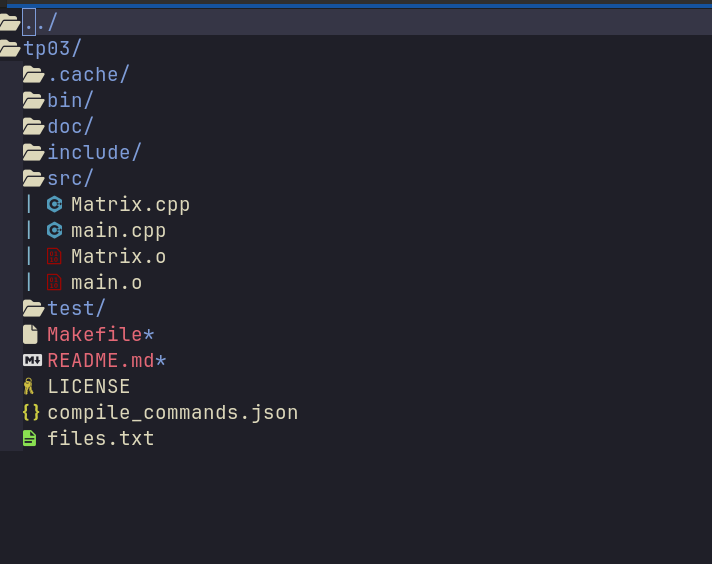

# Neovim Configuration

Welcome to my custom Neovim setup, crafted to enhance Neovim into a powerful editor rivaling IDEs like IntelliJ and VSCode.


---

## 1) Plugin Manager

This configuration uses **Packer** to manage plugins. After importing this configuration for the first time, open Neovim and run:

```bash
:PackerSync
```

This command will download and install every plugin. If you encounter issues with any plugin, you can refer to its GitHub repository for community support. Alternatively, feel free to contact me at fjdbbdizij@gmail.com.

---

## 2) Dependencies

To fully utilize this setup, make sure you have the following installed:

- **Neovim**
- **Clang** and additional C/C++/Java compilers and build tools
- **Nerd Fonts** (for complete icon support)
- **Bear** (build tool for generating `compile_commands.json` for Clangd)
- **fzf** (command-line fuzzy finder)

---

## 3) Features

### Theme

An elegant and minimal theme to enhance your coding experience.


### Register Manager

Easily manage and view your Neovim registers.


### Fuzzy Finder (fzf)

Quickly find files and navigate your project with fzf integration.


### Language Server Protocol (LSP)

Integrated LSP support for code completion, diagnostics, and more.


### Buffer Manager

Easily manage and switch between buffers.


### File Tree

A file tree for structured navigation.



---

## 4) LSP Server Configuration

Currently, this configuration is set up with **Clang** for C/C++ development, but you can install additional LSP servers with the included LSP manager plugin.

### Setting Up Clang LSP Server

To set up the Clang LSP server, create a `compile_commands.json` file in the root of your project directory. You can generate this file by using Bear with your build command. For example:

```bash
bear -- make all
```

This will generate a `compile_commands.json` file with commands and flags used during compilation, essential for LSP functionality. Here is an example of what this file might contain:

```json
[
  {
    "arguments": [
      "/usr/bin/gcc",
      "-I",
      "./include",
      "-I",
      "../include",
      "-Wall",
      "-Wextra",
      "-pedantic",
      "-Wpedantic",
      "-c",
      "-o",
      "src/iplot.o",
      "src/iplot.c"
    ],
    "directory": "/home/username/Documents/project",
    "file": "/home/username/Documents/project/src/iplot.c",
    "output": "/home/username/Documents/project/src/iplot.o"
  }
]
```

---

## License

This configuration is open source and licensed under the **MIT License**.

---

Enjoy coding with this Neovim setup!

